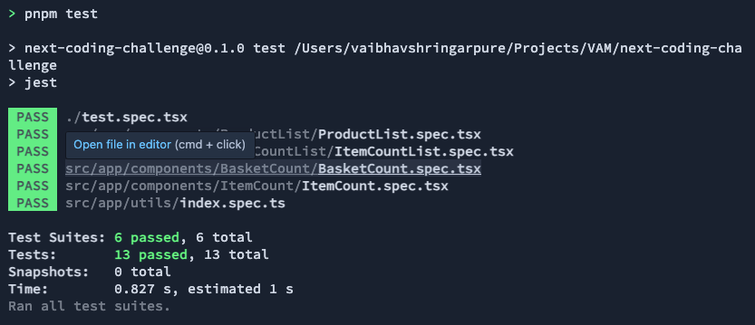
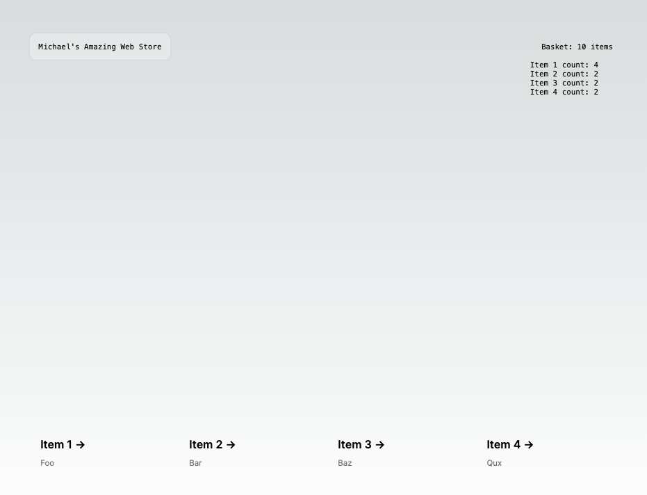

# Michael's NextJS Coding Challenge Solution submitted by Vaibhav Shringarpure vibs.sh@gmail.com

## The Challenge:

Some newb has made a mess of this code. There are TODOs that need finishing off, broken and questionable tests and the code itself is inefficient.  
Please fix up whatever mess you find to get this piece of work working well.

This is a [Next.js](https://nextjs.org/) project bootstrapped with [`create-next-app`](https://github.com/vercel/next.js/tree/canary/packages/create-next-app).

### The Solution

- [x] Fix package.json file to remove lint warning about typescript version for eslint plugin for typescript by installing @typescript-eslint/eslint-plugin. Deleted package-lock.json file and node_modules and reinstalled all the dependencies running `npm install`

- [x] created component for `ItemCount` and unit test
- [x] created a `updaterFn` utility function to update the `quantity` of the clicked item
- [x] separated the `addToCart` function in a utility function
- [x] created `BasketItemCount` component and its unit test
- [x] created `ItemCountList` component and its unit test
- [x] created `ItemCard` component and its unit test
- [x] Fixed the `failing unit test` in `test.spec.tsx` file
- [x] Add unit test for all the new components / utilities.

### ScreenShots

### Author

Vaibhav Shringarpure
vibs.sh@gmail.com
04.06.2024
